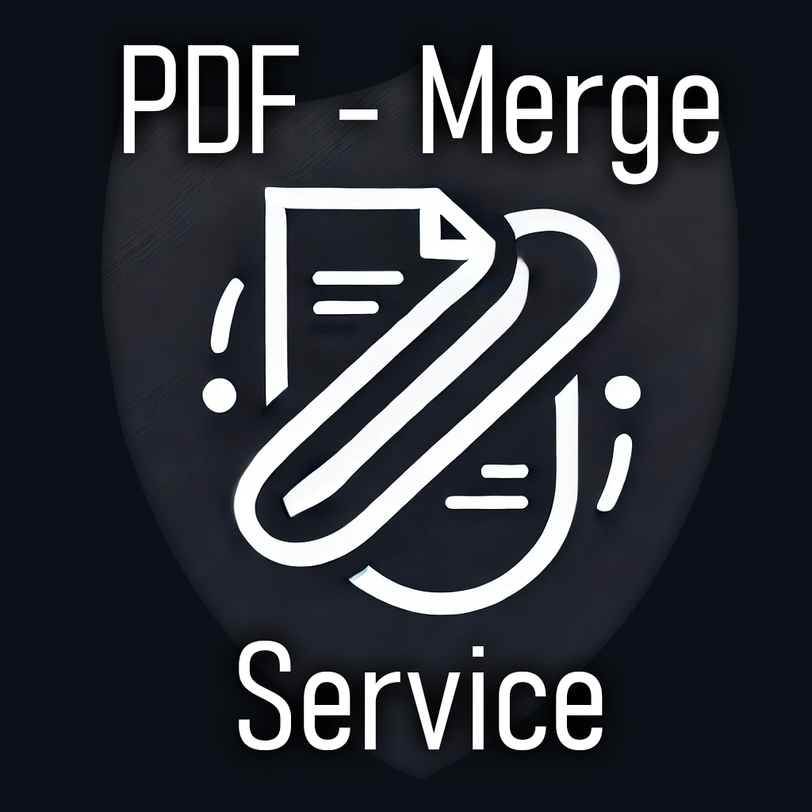

<p align="center"><a href="https://laravel.com" target="_blank"></a></p>


# PDF-Merge-Service

If you want to create duplex scans but your scanner does not support duplex scanning, then the "PDF Merge Service" is just right for you. It monitors an input directory, and as soon as two PDFs are present, they will be merged. PDF 1 - Page 1, PDF 2 - Page 1, PDF 1 - Page 2, PDF 2 - Page 2, and so on. The service can be easily operated via Docker. In addition to the merge function, the PDFs will be prefixed with the creation date (2024_11_05_ORIGINALNAME.pdf). Individual PDFs can also be dated and moved to the output directory; simply place the files in the "input_single" directory.

### Build 
```bash
podman build -t pdf-merge-service .
```

```bash
docker build -t pdf-merge-service .
```

### Run
```bash
docker run -v /path/to/input:/app/input -v /path/to/output:/app/output -d pdf-merge-service
```

##### Example
```bash
podman run -v C:/PDF/input:/app/input -v C:/PDF/output:/app/output -v C:/PDF/input_single:/app/input_single -d pdf-merge-service
```

### Docker-Compose example
```yaml
version: '3.8'

services:
  pdf_merge_service:
    image: pdf-merge-service
    container_name: pdf-merge-service
    restart: unless-stopped
    volumes:
      - /path/to/pdf-merge-service/input:/app/input
      - /path/to/pdf-merge-service/input_single:/app/input_single
      - /path/to/pdf-merge-service/output:/app/output
```
